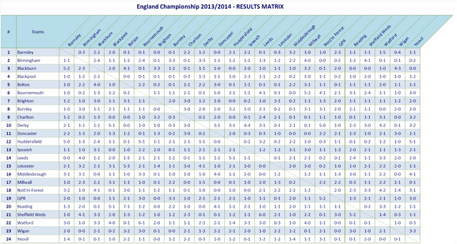

<div align="center">

</div>

<h1 dir="RTL"> 
تمرین سری سوم: از لالیگا تا لیگ برتر
</h1>

> <p dir="RTL"> 
با استفاده از داده های لیگ دسته اول اسپانیا به سوالات زیر پاسخ دهید.
از هر دو ابزار
ggplot2
و
highcharter
برای این کار تصویرسازی استفاده نمایید.
</p>

***

<p dir="RTL">
۱. تعداد قهرمانی های تیم ها در تاریخ لالیگا  را استخراج کرده و نمودار ستونی آنها را رسم کنید.
</p>

<p dir="RTL">
ابتدا برای راحتی کار جدول لالیگا برای سال های مختلف را ایجاد می کنیم:
</p>
```{r}
library(engsoccerdata)
library(dplyr)
library(ggplot2)
library(highcharter)
laliga <- as.tbl(spain) %>% filter(round == "league" & tier == 1)

league_maker <- function(data){
  data %>% group_by(Season, home) %>% summarise(HW = sum(hgoal > vgoal), HL = sum(hgoal<vgoal), HE = sum(hgoal == vgoal), HE0 = sum(hgoal == vgoal & hgoal == 0), HE1 = sum(hgoal == vgoal & hgoal == 1), Hscored = sum(hgoal), Hbeaten = sum(vgoal), HD = sum(hgoal - vgoal)) %>% select(Season, Team = home, HW, HL, HE, HE0, HE1, Hscored, Hbeaten, HD) -> hinfo
  data %>% group_by(Season, visitor) %>% summarise(VW = sum(hgoal < vgoal), VL = sum(hgoal>vgoal), VE = sum(hgoal == vgoal), VE0 = sum(hgoal == vgoal & hgoal ==0), VE1 = sum(hgoal == vgoal & hgoal == 1), Vscored = sum(vgoal), Vbeaten = sum(hgoal), VD = sum(vgoal - hgoal)) %>% select(Season, Team = visitor, VW, VL, VE, VE0, VE1, Vscored, Vbeaten , VD) -> vinfo
  info <- full_join(hinfo, vinfo, c("Season", "Team"))
  info %>% mutate(W = HW + VW, L = HL + VL, E = HE + VE, E0 = HE0 + VE0, E1 = HE1 + VE1, Score = W*3 + E, scored = Hscored + Vscored, beaten = Hbeaten + Vbeaten, Diff = HD + VD) %>% arrange(desc(Season), desc(Score), desc(Diff), desc(scored)) %>% mutate(Rank = row_number()) -> table
  return(table)
}
laliga_table <- league_maker(laliga)
laliga_table
```
<p dir="RTL">
حال به ادامه حل سوالات می پردازیم:
</p>

```{r}
championcount <- laliga_table %>% filter(Rank == 1) %>%  group_by(Team) %>% summarise(count = n()) %>% arrange(desc(count))
ggplot(championcount) + geom_bar(aes(x = reorder(Team, count), y = count), stat = "identity") + labs(y = "Number of championship", x= "Team") + theme_minimal() + coord_flip()
hchart(championcount, type = "bar", hcaes(x = Team, y = count))
```

***

<p dir="RTL">
۲. کسل کننده ترین لیگ و تیم را بیابید.
نمودار ده تیم و ده فصل کسل کننده را رسم کنید.
</p>
<p dir="RTL">
ابتدا متغیری به نام ECount را تعریف می کنیم که نسبت تعداد مساوی ها به کل بازی های لیگ را محاسبه می کند. بر اساس این متغیر لیگی که مقدار بیشتری داشته باشد لیگ کسل کننده تری است!
<br>
همینطور برای هر تیم نسبت تعداد مساوی ها به کل بازی های فصلش را در نظر می گیریم و کسل کننده ترین تیم ها را مشخص می کنیم.
</p>

```{r}
keselLeague <- laliga_table %>% group_by(Season) %>% summarise(ECount = sum(E0 + E1) / sum(E+L+W)) %>% arrange(desc(ECount)) %>% head(10)
keselLeague
ggplot(keselLeague, aes(x=as.factor(Season), y=ECount, fill = ECount)) + geom_col() +coord_flip() + guides(fill = FALSE) + labs(y = "Most kesel leagues", x= "Season")

keselTeam <- laliga_table %>% mutate(EScore = (E0 + E1) /(W+L+E)) %>% group_by(Team) %>% summarise(kesalat = mean(EScore)) %>% arrange(desc(kesalat)) %>% head(10)
keselTeam
hchart(keselTeam, type = "bar", hcaes(x = Team, y = kesalat))
```

***

<p dir="RTL">
۳. در چند درصد موارد قهرمان نیم فصل در پایان فصل قهرمان شده است؟
</p>
<p dir="RTL">
ابتدا نیاز است بازی های نیم فصل تشخیص داده شوند تا طبق آن جدول نیم فصل برای هر فصل مشخص شود.
<br>
برای این کار با توجه به اینکه بازی نیم فصل بین هر دو تیم، بازی ای بین دو تیم است که تاریخش زودتر باشد، ابتدا جدولی ساخته شد که به ازای هر بازی دو سطر به صورت میزبانی هر دو تیم را شامل شود. با این کار تمامی بازی های یک تیم در فصل، در جدول جدید با در نظر گرفتن آن تیم به عنوان میزبان به دست می آید. با اینکار اگر به ازای هر میزبان و میهمان موجود بازی با تاریخ کمتر را از میان بازی های موجود(که تعدادشان ۲ تا است) را در نظر بگیریم به بازی نیم فصل میان آن دو تیم رسیده ایم.
<br>
با اینکار از هر بازی دقیقن دو رکورد داریم که تاثیری در رتبه بندی ندارد و جدول بازی های به دست آمده از فرایند بالا رنک بندی درست نیم فصل را به ما می دهد.
<br>
همچنین با اینکار ریسک انتخاب بازی اشتباه به عنوان بازی نیم فصل (برای مثل در نظر گرفته نشدن بازی های معوقه) را از بین برده ایم.
</p>

```{r, warning=FALSE}
library(dplyr)
#extract data of mid season games
laliga  %>% rename(h = home) %>% rename(home = visitor) %>%  rename(visitor = h) %>% 
  rename(h = hgoal) %>% rename(hgoal = vgoal) %>%  rename(vgoal = h) -> laliga_reversed
rbind(laliga, laliga_reversed) %>% filter(home > visitor) %>% group_by(Season, home, visitor) %>% arrange(Date) %>% slice(1) -> hslaliga
#make table out of mid season games data
hslaliga_table <- league_maker(hslaliga)
# find probability of championship of mid season become championshiop of the season
full_join(hslaliga_table, laliga_table %>% select(Season, Team, FRank = Rank)) %>% group_by(Season) %>% slice(1) %>% summarise(ISIT = (Rank==1 & Rank==FRank)) %>% ungroup(Season) %>% summarise(Percentage = sum(ISIT)/n())
```

***

<p dir="RTL">
۴. در بین سال های ۲۰۰۱ تا ۲۰۱۰ گربه سیاه تیم های بزرگ چه تیم هایی بوده است؟
</p>
<p dir="RTL">
ابتدا سه تیم بزرگ در این سال ها را به دست می آوریم. برای اینکار میانگین رتبه تیم ها در این سال ها را در نظر می گیریم و سه تای برتر را بر اساس آن ها انتخاب می کنیم.
</p>

```{r, warning=FALSE}
laliga_table %>% filter(Season >= 2001 & Season <= 2010) %>% group_by(Team) %>% summarise(avrank = mean(Rank)) %>% arrange(avrank) -> avrankedtable
head(avrankedtable, 3)
```
<p dir="RTL">
برای مشخص کردن گربه سیاه ها جدولی جدید در نظر می گیریم که تعداد برد هر تیم در برابر تیم های قوی و میانگین رتبه اش قرار گرفته است. گربه سیاه تیمی است که رنک بدی داشته باشد ولی تعداد برد نسبتا بالایی داشته باشد. پس بر این اساس می توان Deportivo La Coruna و CA Osasuna و Racing Santander را به عنوان گربه سیاه های این سال ها شناخت.
</p>
```{r, warning=FALSE}
#first we make two way table, means each game is represented as both ways. It is good to have all games of an specific team as home or visitor.
laliga  %>% rename(h = home) %>% rename(home = visitor) %>%  rename(visitor = h) %>% 
  rename(h = hgoal) %>% rename(hgoal = vgoal) %>%  rename(vgoal = h) -> laliga_reversed
rbind(laliga, laliga_reversed) -> twowaylaliga
#then add week to each game so we can analyze vectors then
twowaylaliga %>% group_by(Season, home) %>% arrange(Season, home, Date) %>% mutate(Week = min_rank(Date), equal = hgoal == vgoal, win = hgoal > vgoal, loose = vgoal > hgoal ) -> weekedgames

weekedgames %>% filter(Season >= 2001 & Season <= 2010 & (home == "FC Barcelona" | home == "Real Madrid" | home == "Valencia CF")) %>% group_by(visitor) %>% summarise(Wins = sum(vgoal > hgoal)) %>% arrange(desc(Wins)) %>% select(Team = visitor, Wins) %>% full_join(avrankedtable)
```
***

<p dir="RTL">
۵. در تاریخ لالیگا کدام تیم رکورددار زودترین قهرمانی است؟
همچنین کدام تیم مقتدرانه ترین قهرمانی را داشته است؟
</p>

<p dir="RTL">
قهرمانی زودهنگام وقتی مشخص می شود که در هفته ای اختلاف دو تیم اول بیش از سه برابر هفته های باقیمانده باشد.
</p>

```{r, warning=FALSE}
max = 0
season = 0
team = ""
for(i in unique(weekedgames$Season)){
  tempweeked <- weekedgames %>% filter(Season == i & home > visitor)
  for(j in (max(tempweeked$Week)-6):max(tempweeked$Week)){
    if(max(tempweeked$Week) - j<=max)
      break
    tempLeague <- league_maker(tempweeked %>% filter(Week <= j))
    if(tempLeague$Score[1] - tempLeague$Score[2] > (max(tempweeked$Week) - j)*3){
      max = max(tempweeked$Week) - j
      season = i
      team = tempLeague$Team[1]
    }
  }
}
cat(paste0("*** Fastest championship ***\nTeam: ", team, "\nSeason: ", season, "\nWeeks: ", max, "\n\n"))
```
متغیر اقتدار را برابر اختلاف قهرمان تا تیم دوم تعریف می کنیم و بر اساس آن مقتدرترین قهرمانی را می یابیم:
```{r, warning=FALSE}
laliga_table %>% group_by(Season) %>% summarise(Moghtader = Team[which(Rank == 1)], Eghtedar = Score[which(Rank == 1)] - Score[which(Rank == 2)]) %>% arrange(desc(Eghtedar)) %>% slice(1)
```

***

<p dir="RTL">
۶. طولانی ترین نوار پیروزی مساوی و شکست مال چه تیم هایی است؟
<br>
با کمک گرفتن حلقه و ویژگی های جدول مورد استفاده طولانی ترین نوار ها را در یک فصل می یابیم. برای اینکار ابتدا هفته را برای هر بازی مشخص می کنیم و سپس به دنبال بزرگترین توالی ها در لیست بازی های تیم ها می گردیم.
</p>
```{r, warning=FALSE}
#first we make two way table, means each game is represented as both ways. It is good to have all games of an specific team as home or visitor.
laliga  %>% rename(h = home) %>% rename(home = visitor) %>%  rename(visitor = h) %>% 
  rename(h = hgoal) %>% rename(hgoal = vgoal) %>%  rename(vgoal = h) -> laliga_reversed
rbind(laliga, laliga_reversed) -> twowaylaliga
#then add week to each game so we can analyze vectors then
twowaylaliga %>% group_by(Season, home) %>% arrange(Season, home, Date) %>% mutate(Week = min_rank(Date), equal = hgoal == vgoal, win = hgoal > vgoal, loose = vgoal > hgoal ) -> weekedgames
#analyze vectors to find the answer
windex = 0
wmaximum = 0
eindex = 0
emaximum = 0
lindex = 0
lmaximum = 0
wtemp = 0
etemp = 0
ltemp = 0
for(i in 1:length(weekedgames$home)){
  if(weekedgames$Week[i] == 1){
    wtemp <- 0
    etemp <- 0
    ltemp <- 0
  }
  if(weekedgames$win[i]){
    wtemp <- wtemp + 1
    if(wtemp>wmaximum){
      wmaximum <- wtemp
      windex <- i
    }
  }
  else
    wtemp <- 0
  if(weekedgames$equal[i]){
    etemp <- etemp + 1
    if(etemp>emaximum){
      emaximum <- etemp
      eindex <- i
    }
  }
  else
    etemp <- 0
  if(weekedgames$loose[i]){
    ltemp <- ltemp + 1
    if(ltemp>lmaximum){
      lmaximum <- ltemp
      lindex <- i
    }
  }
  else
    ltemp <- 0
}
cat(paste0("*** Maximum successive wins ***\nTeam: ", weekedgames$home[windex], "\nSeason: ", weekedgames$Season[windex], "\nLength: ", wmaximum, "\n\n"))
cat(paste0("*** Maximum successive equals ***\nTeam: ", weekedgames$home[eindex], "\nSeason: ", weekedgames$Season[eindex], "\nLength: ", emaximum, "\n\n"))
cat(paste0("*** Maximum successive looses ***\nTeam: ", weekedgames$home[lindex], "\nSeason: ", weekedgames$Season[lindex], "\nLength: ", lmaximum, "\n\n"))

```

***

<p dir="RTL">
۷. زودترین سقوط مال کدام تیم بوده است؟
</p>
<p dir="RTL">
سقوط زودهنگام هنگامی در نظر گرفته شده که فاصله تیم آخر تا تیم ۵ تا به آخر (تعداد سقوطی های هر لیگ ۴ تیم در نظر گرفته شده)، بیش از سه برابر هفته های باقیمانده باشد.
</p>
```{r, warning=FALSE}
max = 0
season = 0
team = ""
for(i in unique(weekedgames$Season)){
  tempweeked <- weekedgames %>% filter(Season == i)
  for(j in (max(tempweeked$Week)-12):max(tempweeked$Week)){
    if(max(tempweeked$Week) - j<=max)
      break
    tempLeague <- league_maker(tempweeked %>% filter(Week <= j))
    if(tempLeague$Score[length(tempLeague$Team)-5] - tempLeague$Score[length(tempLeague$Team)-1] > (max(tempweeked$Week) - j)*3){
      max = max(tempweeked$Week) - j
      season = i
      team = tempLeague$Team[length(tempLeague$Team)-1]
    }
  }
}
cat(paste0("*** Fastest fall ***\nTeam: ", team, "\nSeason: ", season, "\nWeeks: ", max/2, "\n\n"))
```

***

<div align="center">

</div>

<p dir="RTL">
مانند شکل بالا تصویری از روند تغییر رتبه تیم ها در طول فصل ۱۹۹۸ رسم نمایید.
</p>
<p dir="RTL">
با توجه به اینکه لالیگای ۱۹۹۸ دارای ۳۸ هفته بوده، رنک بندی را به ازای هر هفته به دست می آوریم.
<br>

```{r message=TRUE, warning=FALSE}
library(ggplot2)
weekdates <- weekedgames %>% filter(Season == 1998) %>% group_by(Week) %>% summarise(date = max(Date)) %>% arrange(Week)
ranks = matrix(nrow = 38, ncol = 20)
for(i in 1:38){
  temptable <- league_maker(weekedgames %>% filter(Season == 1998 & Week <= i)) %>% arrange(Team)
  ranks[i,] = temptable$Rank
}
colnames(ranks) <- temptable$Team
rankedtable <- league_maker(weekedgames %>% filter(Season == 1998))
lastteams <- factor(rankedtable$Team, levels = rankedtable$Team)
ranks.df <- data.frame(ranks, week = 1:38)
plot <- ggplot(ranks.df)  + scale_x_continuous(breaks = seq(1, 38, by = 1)) + scale_y_continuous(breaks = seq(1, 20, by = 1)) + theme_light() + theme(axis.text.x=element_text(angle=90,hjust=1,vjust=0.5), legend.position="bottom") + guides(title)
i<-1
for(name in colnames(ranks.df[1:20])){
  plot <- plot + geom_freqpoly(aes_string(x = "week", y = name, color = lastteams[i]), stat = "identity", binwidth = 10) + ylab("Rank")
  i <- i + 1
}
plot
library(highcharter)
library(rlist)
hseries <- list()
for(i in 1:20){
  hseries[[i]] <- list(
    name = colnames(ranks.df)[i],
    data = ranks.df[,i],
    marker = FALSE
  )
}
highchart() %>%
  hc_legend(enabled = TRUE) %>% 
  hc_xAxis(list(
    tickInterval = 1
  )) %>% 
 hc_yAxis_multiples(
       list(gridLineWidth = 0,
         labels = list(style = list(color = "#012d5a")),
         title = list(enabled = FALSE),
         opposite = FALSE,
         showFirstLabel = FALSE,
         showLastLabel = FALSE,
         tickInterval = 1
    )) %>% 
        hc_add_series_list(hseries) %>% 
  hc_theme(color = colorize(colnames(ranks.df))) -> chart
htmltools::tagList(list(chart))

```

***

<div align="center">

</div>

<p dir="RTL">
۹. جدولی مشابه بالا برای فصل ۲۰۱۲ از  کل نتایج طراحی کنید.
</p>

```{r, warning=FALSE}
games <- laliga %>% filter(Season == 2012)
ggplot(games, aes(y = home, x = visitor)) + geom_tile(fill = "blue") + geom_text(aes(label=FT), color = "white") + scale_x_discrete(position = "top") + guides(fill = FALSE) + theme_minimal()  + theme(axis.text.x=element_text(angle=90,hjust=0,vjust=0.5))
```

***

<p dir="RTL">
۱۰. سه آماره به همراه نمودار فردوسی پسند استخراج کنید.
</p>

<p dir="RTL">
بزرگترین کام بک به سمت قهرمانی!
<br>
در زیر نمودار فصل های با بزرگترین کام بک قهرمانی دیده می شود که نشان دهنده حداکثر رتبه قهرمان فصل در آن فصل می باشند!
<br>
عدد نوشته شده روی نمودار حداکثر رتبه تیم در فصل است!
</p>

```{r, warning=FALSE}
max = 0
season = 0
team = ""
vibrationinfo = list()
Team = c()
MaxRank = c()
for(i in unique(weekedgames$Season)){
  tempweeked <- weekedgames %>% filter(Season == i)
  champion <-league_maker(tempweeked)$Team[1]
  Team <- c(Team, champion)
  maxrank <- 1
  for(j in max(tempweeked$Week)/2:max(tempweeked$Week)){
    maxrank <- max(maxrank, (league_maker(tempweeked %>% filter(Week <= j)) %>% filter(Team == champion))$Rank[1])
  }
  MaxRank = c(MaxRank, maxrank)
}
vibe <- data.frame(season = unique(weekedgames$Season), Team, MaxRank)
as.tbl(vibe) %>% arrange(desc(MaxRank)) %>% head(10)

ggplot(as.tbl(vibe) %>% arrange(desc(MaxRank)) %>% head(10), aes(x = Team, y = as.factor(season), color = as.factor(MaxRank))) + geom_point() + geom_text(aes(label=MaxRank),hjust=.5, vjust=-0.5) + labs(x = "Team", y ="Season") + guides(color = FALSE) + theme_light() + theme(axis.text.x=element_text(angle=90,hjust=1,vjust=0.5))
```

<p dir="RTL">
لوزرترین تیم های لالیگا!
<br>
لوزرترین تیم های لالیگا تیم هایی هستند که علاوه بر آخرین تیم بودن در یک فصل، بدترین رتبه ها را نیز تجربه کرده اند! نمودار زیر این تیم ها را به همراه حداقل رتبه آن ها در فصل مشخص می کند:
<br>
عدد نوشته شده بر روی نمودار مقدار بالاتر آمدن از رتبه آخر است!
</p>
```{r, warning=FALSE}
vibrationinfo = list()
Team = c()
MaxProgress = c()
for(i in unique(weekedgames$Season)){
  tempweeked <- weekedgames %>% filter(Season == i)
  looser <-league_maker(tempweeked)$Team[length(unique(tempweeked$home))]
  Team <- c(Team, looser)
  minrank <- max(tempweeked$Week)
  for(j in max(tempweeked$Week)/2:max(tempweeked$Week)){
    minrank <- min(minrank, (league_maker(tempweeked %>% filter(Week <= j)) %>% filter(Team == looser))$Rank[1])
  }
  MaxProgress = c(MaxProgress,length(unique(tempweeked$home)) - minrank)
}
vibe <- data.frame(season = unique(weekedgames$Season), Team, MaxProgress)
as.tbl(vibe) %>% arrange(MaxProgress) %>% head(10)

ggplot(as.tbl(vibe) %>% arrange(MaxProgress) %>% head(10), aes(x = Team, y = as.factor(season), color = as.factor(MaxProgress))) + geom_point() + geom_text(aes(label=MaxProgress),hjust=.5, vjust=-0.5) + labs(x = "Team", y= "Season") + guides(color = FALSE) + theme_light() + theme(axis.text.x=element_text(angle=90,hjust=1,vjust=0.5))
```
<p dir="RTL">
سرنوشت هجومی ترین های لالیگا!
<br>
نمودار زیر توزیع رتبه کسب شده توسط هجومی ترین تیم های لالیگا را نشان می دهد. هجومی ترین تیم در هر فصل تیمی است که بیشترین تعداد گل زده را کسب کرده باشد!
</p>

```{r, warning=FALSE}
attackers <- laliga_table %>% group_by(Season) %>% arrange(desc(scored)) %>% slice(1) %>% arrange(desc(Season))
hchart(attackers$Rank, type = "histogram", tickInterval = 1)
```

