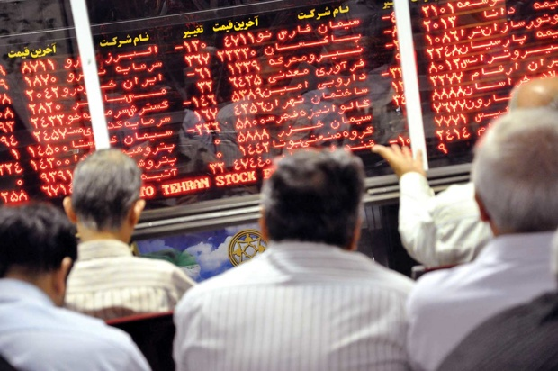

<div align="center">

</div>

> <p dir="RTL"> 
با استفاده از داده های OHLCV شرکت های تشکیل دهنده شاخص s&p500 و همچنین داده مربوط به شاخص های اقتصادی به سوالات زیر پاسخ دهید.
</p>

```{r message=FALSE, warning=FALSE}
library(highcharter)
library(ggplot2)
library(readr)
library(stringr)
library(qcc)
library(ggbiplot)
library(EBImage)
library(dplyr)
library(quantmod)
filenames <- list.files("class_data/stock_dfs/", pattern="*.csv")
stockData = data.frame()
for(filename in filenames){
  data = read_csv(paste("class_data/stock_dfs/", filename, sep = "")) %>%
    mutate(Company = str_remove(filename, ".csv"))
  stockData = rbind(stockData, data)
}
stockData$Year = as.integer(unlist(str_split(stockData$Date, "-"))[c(T, F, F)])
stockData$Month = as.integer(unlist(str_split(stockData$Date, "-"))[c(F, T, F)])
stockData$Day = as.integer(unlist(str_split(stockData$Date, "-"))[c(F, F, T)])
constituents = read_csv("class_data/constituents.csv")
indexes = read_csv("class_data/indexes.csv")
```


***

<p dir="RTL">
۱. چه شرکتی رکورددار کسب بیشترین سود در بازه یکساله، دو ساله و پنج ساله می باشد؟ این سوال را برای بخش های مختلف مورد مطالعه قرار دهید و رکورددار را معرفی کنید. (برای این کار به ستون sector داده constituents مراجعه کنید.) برای هر دو قسمت نمودار سود ده شرکت و یا بخش برتر را رسم نمایید.
</p>
```{r message=FALSE, warning=FALSE}
yearlyStock = stockData %>% dplyr::group_by(Company, Year) %>% dplyr::summarise(StartOpen = first(Open), EndClose = last(Close)) %>% merge(constituents, by.x = "Company", by.y = "Symbol")

#1 year
oneYear = yearlyStock %>% mutate(Profit = EndClose - StartOpen) %>% arrange(desc(Profit)) %>% select(Sector, Name, Year, Profit) %>% dplyr::group_by(Sector) %>%  top_n(1)
oneYear

#2 year
temp = yearlyStock
temp$Year = temp$Year - 1
yearlyStock = yearlyStock %>% merge(temp %>% select(Company, Year, SecondEndClose = EndClose))
twoYear = yearlyStock %>% mutate(Profit = SecondEndClose - StartOpen) %>% arrange(desc(Profit)) %>% select(Sector, Name, Year, Profit) %>% dplyr::group_by(Sector) %>%  top_n(1)
twoYear

#5 year
temp = yearlyStock
temp$Year = temp$Year - 4
yearlyStock = yearlyStock %>% merge(temp %>% select(Company, Year, FifthEndClose = EndClose))
fiveYear = yearlyStock %>% mutate(Profit = FifthEndClose - StartOpen) %>% arrange(desc(Profit)) %>% select(Sector, Name, Year, Profit) %>% dplyr::group_by(Sector) %>%  top_n(1)
fiveYear
```
<p dir="rtl">
حال نمودار را برای ده بخش برتر در هر یک از بازه های یک ساله، دوساله و پنج ساله رسم می کنیم:
</p>
```{r}
hchart(oneYear, type = "column", hcaes(x = Sector, y = Profit)) %>% 
  hc_add_theme(hc_theme_google()) %>% 
  hc_title(text = "One Year")
hchart(twoYear, type = "column", hcaes(x = Sector, y = Profit)) %>% 
  hc_add_theme(hc_theme_google()) %>% 
  hc_title(text = "Two Year")
hchart(fiveYear, type = "column", hcaes(x = Sector, y = Profit)) %>% 
  hc_add_theme(hc_theme_google()) %>% 
  hc_title(text = "Five Year")
```


***

<p dir="RTL">
۲. یک اعتقاد خرافی می گوید خرید سهام در روز سیزدهم ماه زیان آور است. این گزاره را مورد ارزیابی قرار دهید.
</p>
```{r}
stockData %>% filter(Day == 13 & Close>Open) %>% nrow()/nrow(stockData %>% filter(Day == 13))
```
<p dir="RTL">
با توجه به داده های موجود به نظر می رسد در روزهای سیزدهم حدود ۴۹ درصد سهام ها کاهش قیمت داشتند که چیزی برابر نصف است و تقریبا میزان سود و زیان در این روزها برابر بوده و نمی توان این ادعای خرافی را مبنی بر زیان آور بودن خرید سهام در روز های سیزدهم تایید کرد.
</p>

***

<p dir="RTL">
۳. رکورد بیشترین گردش مالی در تاریخ بورس برای چه روزی بوده است و چرا!!!
</p>
<p dir="RTL">
این خواسته با توجه به داده های موجود به طور دقیق قابل محاسبه نبود.
<br>
به همین دلیل ترجیح دادم از یک تقریب نسبتا نزدیک به واقعیت به عنوان گردش مالی استفاده کنم و با توجه به آن محاسبات را انجام دهم. به این صورت که گردش مالی را برای هر شرکت در یک روز برابر میزان معاملات آن سهام ضربدر نصف اختلاف کمترین و بیشترین ارزش آن سهم در آن روز گرفتم. با توجه به این تقریب بیشترین گردش مالی یک روز را محاسبه می کنیم:
</p>
```{r message=FALSE, warning=FALSE}
stockData %>% dplyr::group_by(Date) %>% dplyr::summarise(Turnover = sum(Volume*((High - Low)/2))) %>% arrange(desc(Turnover)) %>% head()
```
<p dir="rtl">
بالاترین گردش مالی برای روز دهم اکتبر سال ۲۰۰۸ به دست آمده است. با تحقیق در رابطه با این تاریخ متوجه می شویم در بازه زمانی بحران مالی جهانی قرار دارد .
<br>
اطلاعات بیشتر در رابطه با این موضوع در ویکی پدیا آورده شده است:
<br>
https://en.wikipedia.org/wiki/Global_financial_crisis_in_October_2008
</p>
***

<p dir="RTL">
۴. شاخص AAPL که نماد شرکت اپل است را در نظر بگیرید. با استفاده از رگرسیون خطی یک پیش کننده قیمت شروع (open price) بر اساس k روز قبل بسازید. بهترین انتخاب برای k چه مقداری است؟ دقت پیش بینی شما چقدر است؟
</p>
<p dir="RTL">
در این سوال من سعی می کنم پارامترهای OHLCV برای ۱ تا k روز قبل را به عنوان پارامتر در نظر بگیرم و با کمک آن قیمت شروع آن روز را حدس بزنم. با این فرض سعی می کنیم با کمک از مدل رگرسیون خطی مدلسازی کنیم:
</p>
```{r warning=FALSE}
AAPL = stockData %>% filter(Company == "AAPL")
AAPL = AAPL[,-8]
train = AAPL
Learning = data.frame()
for(k in 1:150){
  temp = AAPL %>% select(Date, Open, High, Low, Close, Volume)
  temp$Date = lead(temp$Date, k)
  colnames(temp) = c("Date", paste(as.character(k), colnames(temp[,-1]), sep = ""))
  train = merge(train, temp, by = "Date")
  fit = lm(Open ~ ., data = train[,-(c(1,3:10))], na.action = na.omit)
  Learning = rbind(Learning, data.frame(K = k, Error = mean(fit$residuals^2)))
}
```
<p dir="rtl">
از آن جایی که برای k های بزرگتر از ۴ داده ای وجود نداشت (حداکثر داده ۴ روز متوالی موجود بود)، این کار را برای k های ۱ تا ۴ انجام دادیم و نتیجه آن را مشخص کردیم.
<br>
```{r}
Learning %>% arrange(Error) %>% head()
hchart(Learning, type = "line", hcaes(K, Error))
```
<p dir="rtl">
با توجه به مدل استفاده شده که از داده های OHLCV برای k روز قبل استفاده می کرد تا پیش بینی کند، به نظر می رسد همواره با افزایش مقدار k، دقت پیش بینی افزایش  می یابد و خطای کمتری داریم.
</p>

***

<p dir="RTL">
۵. بر روی داده های قیمت شروع شرکت ها الگوریتم pca را اعمال کنید. نمودار تجمعی درصد واریانس بیان شده در مولفه ها را رسم کنید. سه مولفه اول چند درصد از واریانس را تبیین می کند؟
</p>
```{r}
pca.frame = data.frame(Date = unique(stockData$Date))
for(name in unique(stockData$Company)){
  tempData = stockData %>% filter(Company == name)
  temp.frame = data.frame(Date = tempData$Date)
  temp.frame[,name] = tempData$Open
  pca.frame = pca.frame %>% merge(temp.frame)
}
rownames(pca.frame) = pca.frame$Date
pca = prcomp(pca.frame[,-1], center=T, scale.=T)

hchart(data.frame(N = 1:126, Variance = summary(pca)$importance[3,]), type = "line", hcaes(x = N, y = Variance)) %>% 
  hc_add_theme(hc_theme_db()) %>% 
  hc_yAxis(title = list(text = "Proportion of Variance"))

hchart(data.frame(Param = c("PC1", "PC2", "PC3"), Variance = summary(pca)$importance[2,][1:3]), type = "column", hcaes(x = Param, y = Variance)) %>% 
  hc_add_theme(hc_theme_economist()) %>% 
  hc_yAxis(title = list(text = "Proportion of Variance"))
summary(pca)$importance[3,][3]
pca5 = pca
```

***

<p dir="RTL">
۶. برای هر نماد اطلاعات بخش مربوطه را از داده constituents استخراج نمایید. برای هر بخش میانگین روزانه قیمت شروع شرکت های آن را محاسبه کنید. سپس با استفاده از میانگین به دست آمده  داده ایی با چند ستون که هر ستون یک بخش و هر سطر یک روز هست بسازید. داده مربوط را با داده شاخص های اقتصادی ادغام کنید. بر روی این داده pca بزنید و نمودار biplot آن را تفسیر کنید.
</p>
```{r}
namedStockData = stockData %>% merge(constituents, by.x = "Company",by.y = "Symbol")
pca.data = namedStockData %>% dplyr::group_by(Sector, Date) %>% dplyr::summarise(AvgOpen = mean(Open))
pca.frame = data.frame(Date = unique(pca.data$Date))
for(sector in unique(pca.data$Sector)){
  tempData = pca.data %>% filter(Sector == sector)
  temp.frame = data.frame(Date = tempData$Date)
  temp.frame[,sector] = tempData$AvgOpen
  pca.frame = pca.frame %>% merge(temp.frame)
}
pca.frame = pca.frame %>% merge(indexes)
rownames(pca.frame) = pca.frame$Date
pca = prcomp(pca.frame[,-1], center=T, scale.=T)

ggbiplot(pca, obs.scale = 1, var.scale = 1,
  ellipse = TRUE, circle = TRUE) +
  scale_color_discrete(name = '') +
  theme(legend.direction = 'horizontal', legend.position = 'top')
```
<p dir="rtl">
این نمودار بردارهای به دست آمده از PCA را تصویر کرده است. می توان گفت بردارهایی که نزدیکی بیشتری دارند از کوریلیشن بیشتری برخوردارند و بردارهای Long Interest Rate، PE10، Telecomunication و Consumer Price Index نسبت به سایرین مستقل ترند.
</p>

***

<p dir="RTL">
۷. روی همه اطلاعات (OHLCV) سهام اپل الگوریتم PCA را اعمال کنید. سپس از مولفه اول برای پیش بینی قیمت شروع سهام در روز آینده استفاده کنید. به سوالات سوال ۴ پاسخ دهید. آیا استفاده از مولفه اول نتیجه بهتری نسبت به داده open price برای پیش بینی قیمت دارد؟
</p>
```{r message=FALSE, warning=FALSE}
pca.frame = data.frame(AAPL[,-1])
rownames(pca.frame) = AAPL$Date
pca = prcomp(pca.frame[,-c(6:9)], center=T, scale.=T)

train.pca = pca$x %>% as.data.frame() %>% select(PC1)
train.pca$Open = AAPL$Open
LearningPCA = data.frame()
for(k in 1:200){
  train.pca[,paste(as.character(k), "PC1", sep = "")] = lag(train.pca$PC1, k)
  fit = lm(Open ~ ., data = train.pca, na.action = na.omit)
  LearningPCA = rbind(LearningPCA, data.frame(K = k, Error = mean(fit$residuals^2)))
}
```

```{r}
LearningPCA %>% arrange(Error)
hchart(LearningPCA, type = "line", hcaes(K, Error))
```
<p dir="rtl">
می بینیم در اینجا نیز با افزایش k، خطا کاهش می یابد و به مدل بهتری می رسیم. همینطور میزان خطا نیز اختلاف چشم گیری با مدل قبل دارد و کمتر شده است!
</p>

***

<p dir="RTL">
۸. نمودار سود نسبی شاخص s&p500 را رسم کنید. آیا توزیع سود نرمال است؟(از داده indexes استفاده کنید.)
با استفاده از ده مولفه اول سوال پنج آیا می توانید سود و ضرر شاخص s&p500 را برای روز آينده پیش بینی کنید؟ از یک مدل رگرسیون لاجستیک استفاده کنید. درصد خطای پیش بینی را به دست آورید.
</p>
```{r}
sp500 = indexes %>% select(Date, SP500)
sp500$prevSP500 = lag(sp500$SP500,1)
sp500 = sp500 %>% filter(!is.na(prevSP500)) %>% mutate(RelativeProfit = (SP500 - prevSP500)/prevSP500)
hchart(sp500$RelativeProfit, type = "hist") %>% 
  hc_add_theme(hc_theme_flat())
shapiro.test(sp500$RelativeProfit)
```
<p dir="RTL"> 
به نظر می آید که با توجه به نمودار به دست آمده و مقدار پی ولیو پایین به دست آمده از تست shapiro، سود نسبی از توزیع نرمال پیروی می کند.
<br>
حال می خواهیم مدلمان را فیت کنیم. از آن جایی که اشتراک تاریخ میان این داده ها ۴ سطر بیشتر نداشت می بینیم که مدل به دست آمده از کیفیت مناسبی برخوردار نیست. پس از بررسی های مختلف نتوانستم داده کاملی برای SP500 پیدا کنم که بتوانم از آن در این بخش استفاده کرده تا مدل را بهبود دهم.
</p>
```{r message=FALSE, warning=FALSE}
features = pca5$x %>% as.data.frame() 
features = features[,1:10]
features$Date = as.Date(rownames(features))
lm.data = features %>% merge(sp500)
fit = lm(RelativeProfit ~ ., data = lm.data[,-c(1, 12:13)])
summary(fit)
```


***

<p dir="RTL"> 
۹. عکسی که در ابتدای متن آمده را در نظر بگیرید. با استفاده از pca عکس را فشرده کنید. سپس نمودار حجم عکس فشرده بر حسب تعداد مولفه اصلی را  رسم کنید. بهترین انتخاب برای انتخاب تعداد مولفه ها در جهت فشرده سازی چه عددی است؟
</p>

```{r}
pic = readImage("images/stock.jpg")
pic.r = pic[,,1]
pic.g = pic[,,2]
pic.b = pic[,,3]
pic.r.pca = prcomp(pic.r, scale=TRUE)
pic.g.pca = prcomp(pic.g, scale=TRUE)
pic.b.pca = prcomp(pic.b, scale=TRUE)
size = c()
for (k in seq(1, dim(pic)[2], by = 5)) {
  chosen.components = 1:k
  feature.vector.r = pic.r.pca$rotation[,chosen.components]
  feature.vector.g = pic.g.pca$rotation[,chosen.components]
  feature.vector.b = pic.b.pca$rotation[,chosen.components]
  compact.img.r = t(feature.vector.r) %*% t(pic.r)
  compact.img.g = t(feature.vector.g) %*% t(pic.g)
  compact.img.b = t(feature.vector.b) %*% t(pic.b)
  approx.img.r = t(feature.vector.r %*% compact.img.r) 
  approx.img.g = t(feature.vector.g %*% compact.img.g) 
  approx.img.b = t(feature.vector.b %*% compact.img.b)
  approx.img = rgbImage(approx.img.r, approx.img.g, approx.img.b)
  tempAddress = tempfile("", , ".jpeg")
  files = writeImage(approx.img, tempAddress , quality = 100)
  size = c(size, file.info(tempAddress)$size)
  if (file.exists(tempAddress)) file.remove(tempAddress)
}
hchart(data.frame(FeaturesLength = seq(1, dim(pic)[2], by = 5), Size = size), type = "line", hcaes(y = Size, x = FeaturesLength)) %>% 
         hc_add_theme(hc_theme_monokai())
```
<p dir="RTL"> 
حال نمودار پوشش واریانس بر حسب تعداد مولفه های مورد استفاده در کاهش حجم را نیز می کشیم تا بر اساس این دو نمودار بهترین مقدار برای تعداد مولفه ها را بیابیم.
</p>
```{r message=FALSE, warning=FALSE}
highchart() %>% 
  hc_add_series(data.frame(N = 1:412, VariancePercent = summary(pic.r.pca)$importance[3,]), type = "line", hcaes(N, VariancePercent), name = "Red", color = "Red") %>% hc_add_series(data.frame(N = 1:412, VariancePercent = summary(pic.g.pca)$importance[3,]), type = "line", hcaes(N, VariancePercent), name = "Green", color = "Green") %>% hc_add_series(data.frame(N = 1:412, VariancePercent = summary(pic.b.pca)$importance[3,]), type = "line", hcaes(N, VariancePercent), name = "Blue", color = "Blue")
```
<p dir="RTL"> 
نمی دانیم بهترین انتخاب برای مولفه ها چه ویژگی ای دارد ولی به نظر می رسد حدود اعداد ۱۰۰ که واریانس خوبی از داده ها را پوشش می دهند (۹۹ درصد) و در عین حال زیاد نیستند گزینه مناسبی باشند.
</p>

***

<p dir="RTL"> 
۱۰. پنج ایده جالبی که روی داده های مالی بالا می توانستیم پیاده کنیم را بیان کنید. (ایده کافی است نیازی به محاسبه بر روی داده نیست.)
</p>
<p dir="RTL"> 
۱. می توانستیم مدلی برای مشخص کردن سهام با بیشترین سود بسازیم
 <br>
 ۲. می توانستیم مدلی برای پیش بینی پر ارزش ترین سهام های یک سال آینده بسازیم
 <br>
 ۳. می توانستیم مدلی برای پیش بینی پر بازده ترین سهام در یک سال آینده پیش بینی کنیم.
 <br>
 ۴. می توانستیم استیبل ترین سهام ها در مدت ۱۰۰ سال اخیر را مشخص کنیم
 <br>
 ۵. می توانستیم پر چالش ترین سهام ها در ده سال اخیر را مشخص کنیم (دره ها و قله های فراوان و پر ارتفاع در نمودار قیمت سهام!)
</p>
