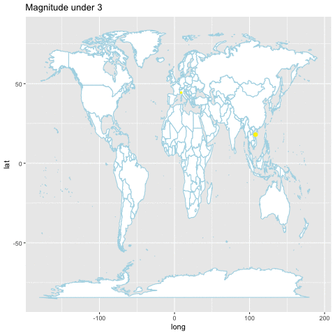

<div align="center">

</div>

> <p dir="RTL"> 
با استفاده از داده های زلزله ها در ایران و جهان به سوالات زیر پاسخ دهید.
</p>

```{r message=FALSE, warning=FALSE}
library(plotly)
library(readr)
library(gganimate)
library(ggmap)
library(dplyr)
library(ggplot2)
library(highcharter)
library(ISOcodes)
library(countrycode)
library(stringr)
library(lubridate)
equake = read_csv("data/worldwide.csv")
Country = c()
for(i in 1:length(equake$place)){
  Country =c(Country, tail(str_split(equake$place[i], ", ")[[1]], 1))
}
equake$Country = Country
equake$Year = format(equake$time, "%Y")
equake$Month = format(equake$time, "%m")
equake$Day = format(equake$time, "%d")

iequake = read_rds("data/iran_earthquake.rds")
disaster = read_delim("data/disaster.txt", "\t", escape_double = FALSE, trim_ws = TRUE)
sequake = read_rds("data/historical_web_data_26112015.rds")
```


***

<p dir="RTL">
۱. با استفاده از داده های
historical_web_data_26112015.rds 
و استفاده از نمودار پراکنش سه بعدی بسته plotly نمودار طول، عرض و عمق زلزله ها را رسم نمایید. علاوه بر آن بزرگی هر نقطه را برابر بزرگی زمین لرزه قرار دهید.
</p>

```{r}
plot_ly(sequake, x=~Longitude, y=~Latitude, z=~Depth, size=~Magnitude)
```


***

<p dir="RTL">
۲. پویانمایی سونامی های تاریخی را بر حسب شدت بر روی نقشه زمین رسم نمایید.(از داده زلزله های بزرگ استفاده نمایید.)
</p>

```{r message=FALSE, warning=FALSE}
worldMap <- map_data("world")
animateData = disaster %>% filter(FLAG_TSUNAMI == "Tsu" & !is.na(LATITUDE) & !is.na(LONGITUDE) & !is.na(LOCATION_NAME)& !is.na(EQ_PRIMARY)) %>% arrange(EQ_PRIMARY)
p = ggplot() +
    geom_polygon(data = worldMap, aes(long, lat, group=group), fill = "white", color = "lightblue") +
  geom_point(data = animateData, aes(LONGITUDE, LATITUDE,
                                                  frame = paste0("Magnitude under ", floor(EQ_PRIMARY)),
                                                  cumulative = T, size = EQ_PRIMARY, color = EQ_PRIMARY)) + scale_color_continuous(low = "yellow", high = "red", guide = F) + scale_size(guide = F)
gganimate(p, filename = "tsunami.gif")
```



***

<p dir="RTL">
۳. نمودار چگالی دو بعدی زلزله های تاریخی ایران را رسم کنید.( از داده iran_earthquake.rds و لایه stat_density_2d استفاده نمایید).
</p>
```{r message=FALSE, warning=FALSE}
iranMap = read_rds("data/Tehrn_map_6.rds")
ggmap(iranMap) + stat_density_2d(geom = "polygon", data = iequake, aes(x =Long, y = Lat, alpha = ..level.., fill = ..level..)) + scale_fill_gradient(low = "blue", high = "red", guide=FALSE) +  scale_alpha(range = c(0.5, 1), guide = FALSE)
```

***

<p dir="RTL">
۴. احتمال اینکه در ایران در پنج سال آینده زلزله به بزرگی هفت ریشتر رخ دهد را محاسبه کنید. (از احتمال شرطی استفاده کنید.)
</p>
<p dir="RTL">
برای این سوال بنده روش های مختلفی را بررسی کردم و در نهایت به این نتیجه رسیدم اینکار می تواند کار منطقی ای باشد.
<br>
به اینصورت که توزیع تجربی فواصل میان زلزله های مختلف بالای ۷ ریشتر که در ایران به وقوع پیوسته را در نظر بگیرم و بر اساس آن احتمال بودن زلزله بعدی تا ۵ سال آینده را از تابع احتمال تجمعی بیابم.
</p>

```{r}
iequake$Year = format(iequake$OriginTime, "%Y")
yearDiffs = disaster %>% filter(COUNTRY == "IRAN" & EQ_PRIMARY > 7) %>% mutate(previousYear = lag(YEAR)) %>% filter(!is.na(previousYear)) %>% mutate(diff = YEAR - previousYear) %>% .$diff
empiricalCDF = ecdf(yearDiffs)
```
<p dir="RTL">
با توجه به اینکه آخرین زلزله در سال ۲۰۱۷ رخ داد، برای محاسبه احتمال رخ دادن زلزله بزرگ تا ۵ سال آینده باید احتمال کمتر بودن فاصله زلزله بعد از ۶ و بیشتر بودن آن از ۱ را بیابیم. پس احتمال آمدن زلزله در پنج سال آینده به شرط نیامدن زلزله در یک سال اخیر را می یابیم:
</p>
```{r}
(empiricalCDF(6) - empiricalCDF(1))/(1-empiricalCDF(1))
```
***

<p dir="RTL">
۵. بر اساس داده های زلزله های بزرگ ابتدا تعداد و متوسط کشته زلزله ها را بر حسب کشور استخراج نمایید. سپس نمودار گرمایی تعداد کشته ها را بر روی کره زمین رسم نمایید.(مانند مثال زیر!)
</p>

<div align="center">

</div>

```{r message=FALSE, warning=FALSE}
deaths = disaster %>% filter(!is.na(TOTAL_DEATHS) & !is.na(COUNTRY)) %>% group_by(COUNTRY) %>% summarise(TotalDeaths = sum(TOTAL_DEATHS), AverageDeaths = mean(TOTAL_DEATHS)) %>% select(country = COUNTRY, TotalDeaths, AverageDeaths)

deaths$Code = countrycode(deaths$country, "country.name", "iso3c")

hcmap(data = deaths, joinBy = c("iso-a3", "Code"), value = "TotalDeaths", name = "Total Deaths")
hcmap(data = deaths, joinBy = c("iso-a3", "Code"), value = "AverageDeaths", name = "Average Deaths")
```

***

<p dir="RTL">
۶. با استفاده از داده لرزه های بزرگ و به وسیله طول، عرض، شدت، عمق مدلی برای پیش بینی تعداد کشته های زلزله بیابید.
</p>
```{r}
trainData = disaster %>% filter(!is.na(TOTAL_DEATHS) & !is.na(LATITUDE) & !is.na(LONGITUDE) & !is.na(FOCAL_DEPTH) & !is.na(EQ_PRIMARY))
fit = lm(data = trainData, TOTAL_DEATHS ~ LONGITUDE + LATITUDE + FOCAL_DEPTH + EQ_PRIMARY)
summary(fit)
```

***

<p dir="RTL">
۷. با استفاده از داده worldwide.csv به چند سوال زیر پاسخ دهید. تحقیق کنید آیا می توان از پیش لرزه، زلزله اصلی را پیش بینی کرد؟
</p>
<p dir="RTL">
برای اینکار ابتدا تعریفی برای پیش لرزه ارائه می دهیم و سپس سعی می کنیم به کمک پیش لرزه ها و مدل رگرسیون خطی، پیش بینی ای برای شدت و زمان زلزله اصلی ارائه کنیم و دقت آن را بررسی کنیم. پیش لرزه را اینگونه تعریف می کنیم که برای هر کشور در هر روز، بزرگترین زلزله را به عنوان زلزله اصلی و سایر زلزله ها را به عنوان پیش لرزه و پس لرزه در نظر می گیریم. سپس زلزله های غیر اصلی که قبل از زلزله اصلی آمدند را به عنوان پیش لرزه برای فیت کردن مدل نگه داری می کنیم.
</p>
```{r message=FALSE, warning=FALSE}
foreShockData = equake %>% group_by(Country, Year, Month, Day) %>% mutate(isMain = (mag == max(mag)), mainMag = max(mag)) %>% arrange(Country, Year, Month, Day, desc(isMain)) %>% mutate(mainTime = first(time)) %>% mutate(timeDiff = floor(as.integer(mainTime - time)/3600)) %>% filter(mainTime>time)
```
<p dir="RTL">
برای هر پیش لرزه شدت زلزله اصلی و فاصله زمانی ساعتی تا وقوع زلزله اصلی را نگه داری می کنیم و سعی می کنیم این مقادیر را با کمک شدت و عمق زلزله حدس بزنیم.
</p>
```{r message=FALSE, warning=FALSE}
#Shuffling data
foreShockData = foreShockData[sample(nrow(foreShockData)),]
train = foreShockData[1:as.integer(0.9 * nrow(foreShockData)),]
test = foreShockData[-(1:as.integer(0.9 * nrow(foreShockData))),]
fit = lm(data = train, mainMag ~ depth + mag)
summary(fit)
summary(stats::predict(fit, test)-test$mainMag)
timeFit = lm(data = train, timeDiff ~ depth + mag)
summary(timeFit)
summary(stats::predict(timeFit, test)-as.integer(test$timeDiff))
```
<p dir="RTL">
مدل را بر روی ۹۰ درصد داده فیت می کنیم و به کمک ۱۰ درصد دیگر خطا ها را بررسی می کنیم. مدل مربوط به شدت زلزله اصلی R-squared حدود ۰.۴۰ و مدل مربوط به فاصله زمانی R-squared بسیار پایینی دارد. این نشان دهنده این است که با اینکه هر دو مدل مدل های نادقیقی برای پیش بینی هستند اما پیش بینی کننده شدت خطای بسیار کمتری نسبت به پیش بینی کننده زمان دارد.
<br>
پس از انجام پیش بینی بر روی داده تست در مدل شدت می بینیم به طور میانگین پیش بینی ها حدود ۰.۰۰۷ ریشتر بیشتر از مقدار واقعی هستند بیشتر خطاها بین مثبت منفی ۰.۵ ریشتر هستند. این خطا در مدل مربوط به زمان به گونه ای است که به طور میانگین خطای پیش بینی حدود ۰.۰۰۲ ساعت است اما بیشتر خطاها بین مثبت منفی ۴.۵ ساعت هستند که خطای قابل توجهی می باشد!
</p>


***

<p dir="RTL">
۸. گزاره " آیا شدت زلزله به عمق آن بستگی دارد" را تحقیق کنید؟ (طبیعتا از آزمون فرض باید استفاده کنید.)
</p>

```{r}
data = equake %>% filter(!is.na(depth) & !is.na(mag))
cor.test(data$depth, data$mag)
hchart(equake %>% head(1000), type = "point", hcaes(depth, mag)) %>% 
  hc_add_theme(hc_theme_darkunica())
```
<p dir="RTL">
با توجه پایین بودن مقدار کوریلیشن به دست آمده، نتیجه می گیریم همبستگی بین این دو متغیر پایین است و شدت زلزله به عمق آن بستگی ندارد. نمودار نقطه ای نشان دهنده شدت زلزله بر حسب عمق زلزله نیز گویای این مسئله می باشد.
</p>

***

<p dir="RTL"> 
۹. میانگین سالانه زلزله ها را بر حسب کشور به دست آورید. آیا میتوان دلیلی در تایید یا رد تئوری هارپ ارائه کرد.
</p>

```{r}
equake %>% group_by(Country, Year) %>% summarise(AverageMagnitude = mean(mag, na.rm = T))
```
<p dir="RTL">
از آن جایی که داده های مربوط به سال های اخیر در اختیار ماست و پروژه هارپ پروژه ای قدیمی است نمی توانیم به طور دقیق آن را بررسی کنیم. اما با توجه به همین داده ها و با این فرض که آمریکا قصد ایجاد تاثیر بر روی برخی کشورهای دیگر دارد، با کمک گرفتن از ایران به عنوان یکی از کشورهای مشکوک، نحوه تغییر تعداد زلزله ها و شدت آن ها را برای سال های مختلف در نظر می گیریم و با آمریکا مقایسه می کنیم.
</p>
```{r}
iran_equake = equake %>% filter(Country == "Iran")
us_states = "Alabama\nAlaska\nArizona\nArkansas\nCalifornia\nColorado\nConnecticut\nDelaware\nFlorida\nGeorgia\nHawaii\nIdaho\nIllinois\nIndiana\nIowa\nKansas\nKentucky\nLouisiana\nMaine\nMaryland\nMassachusetts\nMichigan\nMinnesota\nMississippi\nMissouri\nMontana\nNebraska\nNevada\nNew Hampshire\nNew Jersey\nNew Mexico\nNew York\nNorth Carolina\nNorth Dakota\nOhio\nOklahoma\nOregon\nPennsylvania\nRhode Island\nSouth Carolina\nSouth Dakota\nTennessee\nTexas\nUtah\nVermont\nVirginia\nWashington\nWest Virginia\nWisconsin\nWyoming\nDistrict of Columbia\nPuerto Rico\nGuam\nAmerican Samoa\nU.S. Virgin Islands\nNorthern Mariana Islands"
us_equake = equake %>% filter(str_detect(us_states,Country))
iran_us = rbind(iran_equake, us_equake %>% mutate(Country = "United States"))

#print chart
hcboxplot(x = iran_us$mag, var = iran_us$Year, var2 = iran_us$Country) %>% hc_chart(type = "column")
iran_us %>% group_by(Country, Year) %>% summarise(count = n()) %>% hchart("line", hcaes(x = Year, y = count, group = Country))
```
<p dir="RTL">
با توجه به نمودار جعبه ای مربوط به شدت زلزله ها و نمودار مربوط به تعداد زلزله های سالانه افزایش غیرطبیعی ای در ایران مشاهده نمی شود و به نظر نمی توان این فرضیه را تایید کرد.
</p>

***

<p dir="RTL"> 
۱۰. سه حقیقت جالب در مورد زلزله بیابید.
</p>

```{r}
equake$hour = format(equake$time, "%H")
equake %>% group_by(hour) %>% summarise(averageMag = mean(mag), count = n()) %>% hchart("point", hcaes(x = "hour", y = "count", size = "averageMag"), color = "black")
hcboxplot(x = equake$mag, var = equake$hour, color = "black")
```
<p dir="RTL"> 
در نمودار بالا زلزله های جهان به تفکیک ساعت بررسی شده اند تا تعداد و شدت آن ها مقایسه شوند.
<br>
با توجه به نمودارهای به دست آمده می توان دید بین ساعت ۱۲ تا ۱ بامداد از خطرناک ترین زمان هاست که در آن علاوه بر بالا بودن تعداد زلزله ها، زلزله ها از شدت بالایی نیز برخوردار بوده اند.
<br>
در مقابل با توجه به نمودار تعداد زلرله بر حسب ساعت و توزیع شدت زلزله ها بر حسب ساعت به نظر می رسد در ساعات ۶ تا ۷ صبح نیز هم خطر وقوع زلزله و هم خطر بالا بودن شدت آن کمتر از ساعات دیگر است.
<br>
در ساعات دیگر نیز می توان دید تقریبا توزیع شدت زلزله ها ثابت است و با رفتن از ساعات اولیه روز به ساعات انتهایی تعداد زلزله ها افزایش می یابد.
</p>
```{r}
iequake$hour = format(iequake$OriginTime, "%H")
iequake %>% group_by(hour) %>% summarise(averageMag = mean(Mag), count = n()) %>% hchart("point", hcaes(x = "hour", y = "count", size = "averageMag"), color = "green")
hcboxplot(x = iequake$Mag, var = iequake$hour, color = "green")
```
<p dir="RTL">
با انجام همین بررسی در زلزله های ثبت شده در ایران در سال ۲۰۱۵، نتایج به دست آمده را بررسی می کنیم.
<br>
با توجه به نمودار تعداد بر حسب ساعت می بینیم که در ساعات ۶ تا ۱۵ شاهد یک قله در تعداد هستیم که نشان می دهد بیشترین تعداد زلزله ها در ساعات ۹ تا ۱۰ صبح به وقوع می پیوندند.
<br>
میانگین شدت در ساعات مختلف نیز تقریبا به هم نزدیکند ولی این میزان در ساعات ۹ تا ۱۰ کمتر و پراکندگی آن نیز کمتر است.
</p>
```{r}
iequake %>% group_by(hour) %>% summarise(averageMag = mean(Mag), count = n()) %>% hchart("point", hcaes(x = "count", y = "averageMag",  group = "hour"), color = "green") %>% hc_legend(enabled = F)
iequake %>% group_by(hour) %>% summarise(averageMag = mean(Mag), count = n()) %>% cor.test(formula = ~ averageMag + count, data = .,  method = c("spearman"))
```
<p dir="RTL">
با توجه به نتایج به دست آمده از زلزله های ایران حقیقت جالبی به نظر رسید که آن را بررسی می کنیم.
<br>
به نظر می رسد در ایران با افزایش تعداد زلزله ها در ساعات مختلف، شدت آن ها کاهش می یابد.
<br>
این فرضیه با توجه به نمودار میانگین شدت بر حسب تعداد و تست کوریلیشن رنک شده بر روی این دو متغیر تایید می شوند!
</p>